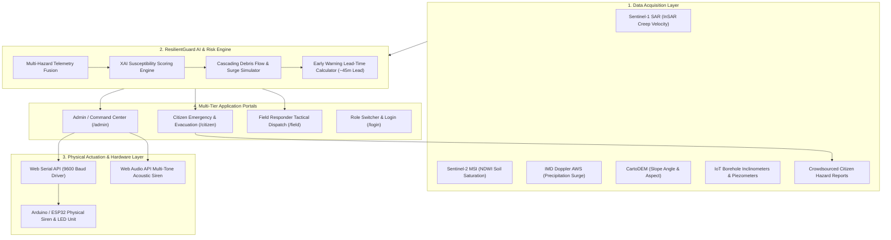

<div align="center">

# 🛡️ ResilientGuard
### AI-Powered Early Landslide & Flood Warning Dashboard & Citizen Emergency System

[](https://www.sih.gov.in/)
[](https://react.dev/)
[](https://vitejs.dev/)
[](https://leafletjs.com/)
[](https://developer.mozilla.org/en-US/docs/Web/API/Web_Serial_API)
[](LICENSE)

<p align="center">
  <strong>An end-to-end, multi-tier geospatial disaster intelligence ecosystem integrating satellite radar (InSAR), IoT slope telemetry, Explainable AI (XAI) risk engines, and real-time citizen evacuation routing.</strong>
</p>

---

[Key Features](#-key-features) • [Architecture](#-system-architecture) • [Portals](#-portals-breakdown) • [Hardware & IoT](#-hardware--iot-integration) • [Quickstart](#-quickstart--installation) • [Scenarios](#-live-demo-scenarios) • [Tech Stack](#-technology-stack)

---

</div>

## 📌 Problem Statement & Vision

Hilly and riverine terrains (such as North-East India, the Western Ghats, and the Himalayas) experience severe landslides and flash floods during intense monsoon downpours. Conventional disaster management setups often face four critical bottlenecks:

> 1. **Data Silos**: Earth observation satellites are disconnected from ground-level IoT inclinometers.
> 2. **Short Lead Time**: Warnings are issued after ground rupture begins rather than during early creep.
> 3. **Communication Gap**: Technical alerts lack plain-language, actionable evacuation paths for citizens.
> 4. **Operational Latency**: Disconnect between command centers, field responders, and isolated villages.

**ResilientGuard** overcomes these barriers by combining multi-sensor IoT telemetry with satellite InSAR phase-displacement analytics and Explainable AI (XAI) risk scoring. It provides citizens with instant, multilingual, turn-by-turn safe evacuation routes, and empowers disaster authorities with hardware-linked acoustic siren triggers and responder dispatch tools.

---

## 🌟 Key Features

### 📡 1. Multi-Sensor Data Fusion & AI Risk Engine
- **Satellite InSAR Interferometry**: Ingests Sentinel-1 C-Band radar phase velocity (+15.8 mm/wk ground creep detection) and Sentinel-2 NDWI (moisture saturation index).
- **In-situ IoT Telemetry**: Borehole inclinometers (tilt acceleration), piezometers (pore water pressure), and IMD Doppler AWS rain gauges.
- **Explainable AI (XAI)**: Transparent feature-weight breakdowns (Radar creep: 44%, Rain surge: 32%, Slope gradient: 14%, Soil moisture: 10%).
- **Cascading Hazard Prediction**: Simulates secondary debris-dam failures and downstream gorge surges before they impact low-lying areas.

### 🗺️ 2. High-Precision Geospatial Web-GIS (Leaflet)
- Interactive, multi-layer GIS map showing real-time hazard polygons, contour elevation zones, and live sensor nodes.
- Dynamic road corridor status (**Open**, **Restricted/Slush**, **Blocked**) with automated rerouting to designated bypasses.
- Designated relief shelter overlays displaying real-time occupancy, medical aid status, and route navigation.

### 🚨 3. Common Alerting Protocol (CAP) & Siren Dispatch
- Multi-channel warning dissemination: **App Push**, **Bilingual SMS**, **VHF SDRF Relay**, and **Acoustic Siren Blasts**.
- **Browser-Native Web Audio Siren**: Synthesizes customizable multi-tone acoustic alarm sirens directly in the client.
- **Physical Hardware Siren Trigger**: Employs the **Web Serial API** to send binary control signals directly to connected Arduino / ESP32 LED and buzzer units.

### 📱 4. Citizen Safety & Offline Resilience
- **One-Touch Emergency SOS**: Transmits real-time GPS coordinates directly to SDRF/NDRF Quick Response Teams (QRT).
- **Crowdsourced Hazard Reporting**: Allows citizens to submit geotagged photos of tension cracks and road blockages for patrol verification.
- **Offline Mesh / Cache Mode**: Caches vital evacuation pathways, shelter coordinates, and helpline numbers for disconnected scenarios.
- **Multilingual Support**: Built-in localization support for regional languages.

---

## 🏛️ System Architecture



---

## 🖥️ Portals Breakdown

### 1. Citizen Portal
- **Route:** `/` or `/citizen`
- **Target User:** Citizens, Commuters, Evacuees
- **Primary Capabilities:**
  - Live hazard danger index & plain-language safety advisories
  - Evacuation route navigation & designated relief shelter locator
  - Instant SOS distress beacon & emergency helpline direct dialer (112 / 1077)
  - Geotagged crowdsourced hazard reporting with photo uploads and crack tagging
  - Offline cache mode for network blackout resilience

### 2. Admin & Command Center Portal
- **Route:** `/admin`
- **Target User:** State Disaster Management (SDMA), NDRF, Incident Commanders
- **Primary Capabilities:**
  - Real-time multi-zone IoT sensor telemetry (inclinometers, piezometers, IMD rain gauges)
  - Sentinel-1 InSAR radar surface creep & Sentinel-2 moisture index inspection
  - Explainable AI (XAI) risk score & feature-weight breakdown
  - Common Alerting Protocol (CAP) multi-channel alert broadcast approval system
  - Citizen evacuation tracking & SDRF/NDRF Quick Response Team (QRT) dispatch
  - Web Serial API controller for physical hardware sirens & LED beacons

### 3. Field Responder Portal
- **Route:** `/field`
- **Target User:** SDRF Teams, PWD Road Clearing Units, Paramedics
- **Primary Capabilities:**
  - Live tactical incident backlog & priority dispatch queue
  - Road blockage clearance status & bulldozer deployment tracking
  - Survivor intake counters & medical aid shelter synchronization
  - Direct field report verification and ground check approval tools

### 4. Authentication Portal
- **Route:** `/login`
- **Target User:** All Roles
- **Primary Capabilities:**
  - Instant role switcher between Citizen, Disaster Authority, and Field Responder profiles

---

## 🔌 Hardware & IoT Integration

ResilientGuard communicates directly with microcontrollers over USB/COM serial via the **W3C Web Serial API**, enabling real-time physical siren and warning light activation without installing third-party desktop drivers.

```
┌─────────────────────────────────────────┐
│     ResilientGuard Admin Dashboard      │
└────────────────────┬────────────────────┘
                     │ (Web Serial API @ 9600 Baud)
                     ▼
┌─────────────────────────────────────────┐
│       Arduino / ESP32 Microcontroller   │
└───────┬─────────────────┬───────────────┘
        │                 │
        ▼                 ▼
 ┌──────────────┐  ┌──────────────┐
 │  3-Color LED │  │ High-Decibel │
 │ Status Light │  │ Alarm Siren  │
 └──────────────┘  └──────────────┘
```

### Microcontroller Firmware Sample (Arduino C++)

```cpp
// Flash to Arduino Uno / ESP32 connected via USB
const int RED_LED_PIN = 12;
const int SIREN_PIN   = 13;

void setup() {
  Serial.begin(9600);
  pinMode(RED_LED_PIN, OUTPUT);
  pinMode(SIREN_PIN, OUTPUT);
  digitalWrite(RED_LED_PIN, LOW);
  digitalWrite(SIREN_PIN, LOW);
}

void loop() {
  if (Serial.available() > 0) {
    char command = Serial.read();
    if (command == '1' || command == 'A') {
      // Emergency: Activate siren and alert light
      digitalWrite(RED_LED_PIN, HIGH);
      digitalWrite(SIREN_PIN, HIGH);
    } else if (command == '0' || command == 'S') {
      // Standby / All-Clear
      digitalWrite(RED_LED_PIN, LOW);
      digitalWrite(SIREN_PIN, LOW);
    }
  }
}
```

---

## 📂 Project Structure

```text
SIH/
├── Frontend/
│   ├── index.html                   # HTML entrypoint & typography configuration
│   ├── package.json                 # Frontend dependencies & Vite scripts
│   ├── vite.config.js               # Vite bundler configuration
│   └── src/
│       ├── App.jsx                  # Main application router (React Router)
│       ├── main.jsx                 # React root renderer
│       ├── components/              # Reusable UI widgets
│       ├── pages/
│       │   ├── CitizenPortal.jsx    # Citizen evacuation & hazard dashboard
│       │   ├── AdminPortal.jsx      # Command center & multi-sensor telemetry
│       │   ├── FieldPortal.jsx      # SDRF tactical dispatch & road clearance
│       │   └── LoginPortal.jsx      # Role switcher & authentication UI
│       ├── styles/
│       │   ├── styles.css           # Citizen portal styles & glassmorphic tokens
│       │   ├── admin.css            # Command center dark theme & HUD styles
│       │   ├── field.css            # Field responder tactical styles
│       │   └── login.css            # Authentication styling
│       └── utils/
│           ├── adminData.js         # Geospatial zone databases & sensor telemetry
│           ├── citizenData.js       # Evacuation routes, shelters & i18n strings
│           ├── fieldData.js         # Tactical missions & survivor triage states
│           ├── arduinoSerial.js     # Web Serial API driver for hardware alerts
│           └── audioAlarm.js        # Multi-tone Web Audio acoustic siren generator
└── package.json                     # Root project script runner
```

---

## 🚀 Quickstart & Installation

### Prerequisites
- **Node.js**: v18.0.0 or higher
- **npm**: v9.0.0 or higher
- **Browser**: Google Chrome, Microsoft Edge, Brave, or Opera (for Web Serial API support)

### 1. Clone the Repository
```bash
git clone https://github.com/sush159/SIH2026.git
cd SIH
```

### 2. Install Dependencies
```bash
npm install
# Or inside the Frontend folder:
cd Frontend && npm install && cd ..
```

### 3. Start the Development Server
```bash
npm run dev
```

### 4. Access the Portals
Open your browser and navigate to:
```
http://localhost:5173/
```

- **Citizen Emergency Portal**: `http://localhost:5173/citizen`
- **Admin & Command Center**: `http://localhost:5173/admin`
- **Field Responder Portal**: `http://localhost:5173/field`
- **Role Switcher**: `http://localhost:5173/login`

---

## 🧪 Live Demo Scenarios

The dashboard features real-world calibrated simulation profiles:

### 🔴 Scenario 1: Shillong Urban Ridge (Meghalaya) — Level 4 Red Alert
- **Telemetry**: 118.0 mm / 24h continuous downpour, 89.2% pore saturation, 4.8°/hr tilt acceleration.
- **InSAR Satellite**: Sentinel-1 records +15.8 mm/wk surface creep with 3.8m tension fissure.
- **Cascading Trigger**: +2.4m downstream surge warning from storm drainage encroachment.
- **Evacuation Plan**: Diverts traffic from GS Road to Upper Shillong Bypass towards Shillong Municipal Relief Center #1.

### 🟠 Scenario 2: Cherrapunji (Sohra) Escarpment — Escarpment Runoff Failure
- **Telemetry**: 214.0 mm / 24h extreme rainfall on steep sandstone scarp.
- **Blockade**: 4,200 m³ rockfall closing SH-5 highway.
- **Action**: Activates Mawkdok Ridge bypass and broadcasts automated bilingual siren alerts.

### 🟡 Scenario 3: Remote Arunachal Himalayan Slopes — Slope Watch
- **Telemetry**: 68.4% volumetric soil moisture on a 41.2° glacial-fluvial slope.
- **InSAR Satellite**: +6.8 mm/wk tension creep on upper mountain terrace.
- **Action**: Dispatches SDRF reconnaissance unit and issues watch advisory to Walong North Sector.

---

## 🛠️ Technology Stack

- **Frontend Core Framework:** React 19 (`react`, `react-dom`)
- **Build Tooling & Bundler:** Vite 8.2 with Hot Module Replacement (HMR)
- **Navigation & Routing:** React Router v7 (`react-router-dom`)
- **Geospatial & Mapping Engine:** Leaflet 1.9 with OpenStreetMap & Carto Basemaps
- **Hardware Integration Driver:** Web Serial API (W3C standard for direct USB/COM microcontroller connectivity)
- **Acoustic Audio Processing:** Web Audio API (Client-side multi-frequency siren tone synthesizer)
- **Typography:** Google Fonts (*Plus Jakarta Sans* & *JetBrains Mono*)
- **UI Styling:** Vanilla CSS Design Tokens with modern Dark-Mode Glassmorphism

---

## 🏆 Smart India Hackathon (SIH 2026) Value Matrix

- **Technical Innovation:** Fuses Earth Observation satellite data (Sentinel-1 InSAR / Sentinel-2 NDWI) with low-cost edge IoT slope telemetry and Explainable AI (XAI).
- **Actionable Lead Time:** Transitions disaster management from reactive recovery to proactive evacuation with up to ~45 minutes of actionable lead time.
- **Grassroots Impact:** Delivers citizen-first evacuation routing, offline operation, and direct hardware siren alerts to prevent panic and save lives.
- **Ease of Deployment:** 100% web-native architecture requiring zero driver installation, compatible with standard smartphones and microcontrollers.

---

## 📄 License

This project is licensed under the **ISC License** — see the [LICENSE](LICENSE) file for details.

---

<div align="center">

**Smart India Hackathon 2026** • ResilientGuard — Protecting Communities Through AI & Geospatial Intelligence

</div>
