# ResilientGuard: AI-Powered Early Warning and Landslide Risk Monitoring for North East India

<div align="center">

[](https://www.sih.gov.in/)
[](https://www.sih.gov.in/)
[](https://mdoner.gov.in/)
[]()
[-purple.svg?style=for-the-badge)]()

**A predictive early warning and offline-resilient disaster response platform fusing satellite radar/optical earth observation, IoT edge telemetry, and a three-stage Explainable AI risk engine.**

[Core Portals](#6-core-portals-and-features) | [System Architecture](#4-system-architecture) | [AI Risk Engine](#layer-2--three-stage-ai-engine-and-fusion-layer) | [Hardware Architecture](#5-supplementary-hardware-architecture-edge-iot) | [Installation Guide](#8-getting-started-and-installation)

</div>

---

## Table of Contents
- [1. Executive Summary](#1-executive-summary)
- [2. Problem Context: North East India (NER)](#2-problem-context-north-east-india-ner)
- [3. Key Innovations and Technical Differentiators](#3-key-innovations-and-technical-differentiators)
- [4. System Architecture](#4-system-architecture)
  - [Layer 1: Multi-Source Data Ingestion and Deterministic GIS](#layer-1--multi-source-data-ingestion-and-deterministic-gis)
  - [Layer 2: Three-Stage AI Engine and Fusion Layer](#layer-2--three-stage-ai-engine-and-fusion-layer)
  - [Layer 3: Backend and Escalating Alert Orchestration](#layer-3--backend-and-escalating-alert-orchestration)
  - [Layer 4: Application Layer and GIS Interfaces](#layer-4--application-layer-and-gis-interfaces)
- [5. Supplementary Hardware Architecture (Edge IoT)](#5-supplementary-hardware-architecture-edge-iot)
- [6. Core Portals and Features](#6-core-portals-and-features)
  - [District GIS Command Dashboard](#district-gis-command-dashboard-admin)
  - [Citizen Reporting and Early Warning Portal](#citizen-reporting-and-early-warning-portal-citizen)
  - [Field Officer Tactical Operations Portal](#field-officer-tactical-operations-portal-field)
  - [Role-Based Authentication and Access Dispatch](#role-based-authentication-and-access-dispatch-login)
- [7. Technology Stack](#7-technology-stack)
- [8. Getting Started and Installation](#8-getting-started-and-installation)
- [9. Datasets and Public Licensing](#9-datasets-and-public-licensing)
- [10. Impact Assessment and Future Roadmap](#10-impact-assessment-and-future-roadmap)
- [11. References and Agency Standards](#11-references-and-agency-standards)

---

## 1. Executive Summary

Landslides across India's North Eastern Region (NER) cause recurring loss of life, sever vital road networks, and isolate rural communities during heavy monsoon seasons. Existing disaster management workflows remain largely reactive: district authorities often learn of a slope failure or road blockage only after the event has occurred. Furthermore, severe weather often causes telecommunication blackouts, making standard internet- or app-dependent warning systems unreliable.

ResilientGuard addresses this gap by combining free satellite earth observation, low-cost edge sensors, and a three-stage machine learning pipeline into a continuous spatial risk index. When risk thresholds are exceeded, the system triggers an escalating, multi-channel alert protocol engineered to function even during severe network and power outages.

The platform determines three critical dimensions of slope hazard:
- **Where:** Baseline structural and geological susceptibility via gradient-boosted decision trees (XGBoost).
- **When:** Imminent trigger probability across a rolling 72-hour window using recurrent memory networks (LSTM).
- **What:** Ground-truth classification of citizen- and officer-submitted images using convolutional vision models (CNN).

The platform uses only free, public datasets and open-source software libraries, eliminating recurring licensing overhead for state agencies. Operating on an offline-first architecture, it can fail over from LoRa mesh radio to SMS, Bhashini-powered regional voice alerts, and autonomous local siren units.

```
+----------------------------------------------------------------------------------------------------+
|                                    RESILIENTGUARD AT A GLANCE                                      |
+------------------------------------+----------------------------------+----------------------------+
| Where: Susceptibility (XGBoost)    | When: Real-Time Trigger (LSTM)   | What: Visual Confirmation  |
| Slope, soil, geology, road buffer  | 72h rolling rain, moisture, tilt | Crack, debris, road block  |
+------------------------------------+----------------------------------+----------------------------+
| Explainable: SHAP Attribution      | Offline-First: LoRa + Siren Node | Multilingual: Bhashini TTS |
+------------------------------------+----------------------------------+----------------------------+
```

---

## 2. Problem Context: North East India (NER)

The eight states of the North Eastern Region face compounded geo-hydrological hazards due to several distinct regional conditions:

- **Fragile Geological Formations:** Steep young fold mountains with high weathering rates, structural joints, and seismic vulnerability.
- **Intense Monsoon Precipitation:** Prolonged, concentrated rainfall rapidly increases soil pore-water pressure and exceeds shear strength thresholds.
- **Single-Corridor Arterial Routes:** Mountain towns depend on single highway arteries (such as NH-06 and NH-29). A single major slope failure can cut off food, fuel, and medical logistics for days.
- **Severe Communication Vulnerability:** Monsoons regularly damage mobile towers and power grids, rendering cloud-only alerting ineffective when needed most.

---

## 3. Key Innovations and Technical Differentiators

| Innovation | Technical Overview |
| :--- | :--- |
| **InSAR Multi-Trigger and Creep Detection** | Uses Sentinel-1 radar interferometry to measure millimeter-scale slope displacement over time, identifying slow slope creep before surface cracks or rainfall triggers become evident. |
| **Silence as a Signal Protocol** | If an IoT sensor abruptly ceases transmission immediately following high-risk readings, the system treats this sudden loss of signal as active physical destruction or burial, escalating the zone alert immediately. |
| **Three-Stage Explainable AI (XAI)** | Combines static susceptibility, dynamic time-series triggers, and visual evidence. Each composite score is decomposed into plain-language SHAP contributions for administrative clarity. |
| **Cascading Road Isolation Simulator** | Models regional transport networks as a directed graph. Simulating a road segment blockage instantly calculates isolated settlements, affected population counts, and suggested bypass routes. |
| **Escalating Multi-Channel Alerts** | Cascades from Web Push $\rightarrow$ Direct SMS $\rightarrow$ Automated Bhashini AI Voice Calls in local languages (Assamese, Mizo, Khasi, Hindi) $\rightarrow$ Physical Village Siren. |
| **Household Guardian Box Concept** | Low-cost, radio-triggered indoor receiver nodes designed to alert residents inside their homes without requiring smartphone ownership or active internet access. |

---

## 4. System Architecture

```mermaid
flowchart TB
    subgraph L1["Layer 1: Multi-Source Data Collection and GIS Preprocessing"]
        A1["Sentinel-1 SAR Radar Displacement"]
        A2["Sentinel-2 Optical NDVI Vegetation"]
        A3["IMD Live Precipitation and Forecast API"]
        A4["SRTM / Bhuvan 30m Digital Elevation Models"]
        A5["GSI Historical Landslide Inventory and Soil Maps"]
        A6["Citizen and Field Officer Ground Truth Data"]
        A7["IoT Field Sensor Telemetry via LoRa Nodes"]
    end

    subgraph L2["Layer 2: Three-Stage Machine Learning Pipeline"]
        B1["Model 1: Susceptibility (XGBoost)\n- Spatial Vulnerability (Where)"]
        B2["Model 2: Trigger Prediction (LSTM)\n- Rolling 72h Moisture & Tilt Window (When)"]
        B3["Model 3: Visual Confirmation (CNN)\n- Surface Crack and Debris Classifier (What)"]
        B4["Multi-Hazard Risk Fusion Layer\nWeighted Confidence + SHAP Interpretability"]
    end

    subgraph L3["Layer 3: Backend and Resilient Alert Orchestration"]
        C1["FastAPI Services & PostgreSQL / PostGIS Spatial Database"]
        C2["Common Alerting Protocol (CAP / NDMA SACHET Format)"]
        C3["Smart Alert Escalation Engine\nPush -> SMS -> Bhashini Voice -> Local Siren"]
        C4["Network Graph Engine: Road Network & Village Isolation Analysis"]
    end

    subgraph L4["Layer 4: User Interfaces and Field Actuation"]
        D1["District GIS Command Dashboard"]
        D2["Offline-First Citizen Reporting Web Application"]
        D3["Tactical Field Officer Incident Portal"]
        D4["Autonomous Village Siren and LoRa Gateway Unit"]
    end

    L1 --> L2
    A1 & A2 & A4 & A5 --> B1
    A3 & A7 --> B2
    A6 --> B3
    B1 & B2 & B3 --> B4
    B4 --> L3
    L3 --> L4
```



### Layer 1 — Multi-Source Data Ingestion and Deterministic GIS
- **NDVI Vegetation Cover:** Computed per-pixel from Sentinel-2 bands using $(NIR - Red) / (NIR + Red)$.
- **Slope Gradient and Curvature:** Calculated trigonometrically from 30m SRTM and Bhuvan DEMs.
- **Road Proximity Index:** Distance buffers computed against OpenStreetMap road vectors.
- **Unified Feature Store:** Features update on distinct, asynchronous cadences without blocking real-time processing.

### Layer 2 — Three-Stage AI Engine and Fusion Layer
1. **Susceptibility Model (XGBoost):** Produces a baseline spatial hazard probability ($0.0 - 1.0$) per zone. Handles missing data robustly during cloud-covered satellite passes.
2. **Real-Time Trigger Model (LSTM):** Evaluates rolling 72-hour cumulative precipitation, pore-water pressure, and slope tilt angles to capture cumulative soil saturation dynamics.
3. **Image Classification Model (CNN):** A MobileNetV2/EfficientNet transfer-learned network trained to identify tension cracks, minor debris, and structural road obstructions.
4. **SHAP Interpretability Layer:** Translates raw model outputs into human-readable feature contributions (e.g., 35% slope steepness, 30% soil saturation, 20% rainfall spike).

### Layer 3 — Backend and Escalating Alert Orchestration
- **Response Prioritization Ranking:** Combines composite risk, settlement population, and road access into an operational priority index.
- **CAP Compliance:** Formats all alert payloads to Common Alerting Protocol standards compatible with NDMA SACHET.
- **Two-Way Acknowledgment Loop:** Allows recipients to return status updates (Safe / Need Help) to assist emergency triage.

### Layer 4 — Application Layer and GIS Interfaces
- **Web GIS Interface:** High-performance mapping using Leaflet and vector layers for rainfall, risk zones, evacuation routes, and sensor nodes.
- **PWA Service Worker:** Enables client-side caching and offline report storage with background synchronization.

---

## 5. Supplementary Hardware Architecture (Edge IoT)

```
                       +-----------------------------+
                       |     Solar Panel (6V 2W)     |
                       +--------------+--------------+
                                      |
                      +---------------+---------------+
                      | TP4056 + 18650 Li-ion Battery |
                      +---------------+---------------+
                                      |
+-------------------------------------+-------------------------------------+
|                     LOW-POWER EDGE SENSOR NODE (FIELD)                    |
|                                                                           |
|   +-------------------+  +-------------------+  +---------------------+   |
|   | Capacitive Soil   |  | MPU6050 (Tilt &   |  | Tipping-Bucket Rain |   |
|   | Moisture Sensor   |  | Vibration Sensor) |  | Gauge Sensor        |   |
|   +---------+---------+  +---------+---------+  +----------+----------+   |
|             |                      |                       |              |
|             +----------------------+-----------------------+              |
|                                    |                                      |
|                       +------------v------------+                         |
|                       |  Arduino Pro Mini MCU   |                         |
|                       +------------+------------+                         |
|                                    |                                      |
|                       +------------v------------+                         |
|                       |   LoRa SX1278 (433MHz)  | (5 - 15 km Line of Sight|
+------------------------------------+--------------------------------------+
                                     |
                                     v
+------------------------------------+--------------------------------------+
|                     PANCHAYAT GATEWAY & SIREN UNIT                        |
|                                                                           |
|   +--------------------+  +--------------------+  +-------------------+   |
|   | LoRa Receiver Unit |  | ESP32 Host MCU     |  | SIM800L GSM Unit  |   |
|   +---------+----------+  +---------+----------+  +---------+---------+   |
|             |                       |                       |             |
|             +-----------------------+-----------------------+             |
|                                     |                                     |
|             +-----------------------+-----------------------+             |
|             |                                               |             |
|   +---------v---------+                           +---------v---------+   |
|   | 110dB Siren Relay | (Autonomous Local Alert)  | Cellular / IP Net |   |
|   +-------------------+                           +---------+---------+   |
+-------------------------------------------------------------+-------------+
                                                              |
                                                              v
                                              +---------------+---------------+
                                              | ResilientGuard Cloud Platform |
                                              +-------------------------------+
```

- **Field Nodes:** Ultra-low-power microcontrollers in IP67 enclosures, powered by 18650 lithium cells with solar trickle charging.
- **LoRa Telemetry:** Long-range sub-gigahertz telemetry spanning 5–15 km through forested mountain terrain without cellular network dependency.
- **Panchayat Gateway:** Autonomous threshold evaluation triggers the local siren and dispatches SMS alerts even during a total cloud connection loss.

---

## 6. Core Portals and Features

### District GIS Command Dashboard (`/admin`)
- **Interactive Risk Heatmap:** Real-time spatial risk visualization covering key regional corridors (such as Sohra Ridge, Kohima Bypass, and Aizawl Slope-7).
- **Cascading Isolation Simulator:** Graph-based infrastructure evaluation that flags cut-off settlements and computes alternate relief corridors.
- **Telemetry Monitoring:** Live chart streams for pore-water pressure, cumulative rainfall, and slope tilt angles.
- **Incident Dispatch & Resource Management:** Real-time tracking of response teams, equipment availability, and field operations.

### Citizen Reporting and Early Warning Portal (`/citizen` or `/`)
- **Zero-Install Web Application:** Mobile-responsive Progressive Web App running in standard modern browsers.
- **Geo-Tagged Incident Uploads:** One-tap photo and video submission with automatic GPS coordinate tagging.
- **Regional Language Support:** Native language selection across English, Hindi, Assamese, and Mizo.
- **Offline Submissions:** Reports submitted without network access are stored in local browser cache and automatically synced once connectivity returns.

### Field Officer Tactical Operations Portal (`/field`)
- **Ground-Truth Verification:** Incident triage queue for on-site assessment and status updates.
- **Hardware Telemetry Diagnostics:** Battery, signal strength, and health metrics for remote sensor nodes.
- **Relief Resource Inventory:** Field-level tracking of shelter capacities, medical equipment, and heavy machinery.

### Role-Based Authentication and Access Dispatch (`/login`)
- Role switcher and authentication routing for Administrators, Response Coordinators, Field Officers, and Public Citizens.

---

## 7. Technology Stack

| Component | Technology | Role |
| :--- | :--- | :--- |
| **Frontend Framework** | React 19, Modern CSS Design System, Vite | Responsive, accessible, and fast web application interface |
| **Spatial Mapping** | Leaflet.js, MapLibre GL, OpenStreetMap | Interactive GIS map overlays, road network graphs, and heatmaps |
| **Machine Learning** | XGBoost, TensorFlow / PyTorch (LSTM & CNN), SHAP | Susceptibility, trigger time-series prediction, and vision inference |
| **Geospatial Processing** | PostGIS, GDAL, Rasterio, QGIS | Digital Elevation Model analysis, NDVI extraction, and raster zoning |
| **Data Ingestion** | Sentinel-1 InSAR, Sentinel-2, IMD Weather API | Multi-source satellite earth observation and live meteorological data |
| **IoT Hardware** | Arduino Pro Mini, ESP32, LoRa SX1278, MPU6050, SIM800L | Remote ground-truth sensing and autonomous village siren activation |
| **Alerting Infrastructure** | Digital India Bhashini, SMS Gateways, CAP Standard | Multilingual speech synthesis, voice broadcasting, and standard alert feeds |

---

## 8. Getting Started and Installation

### Prerequisites
- Node.js (v18.0.0 or higher recommended)
- npm (v9.0.0 or higher)

### 1. Clone the Repository
```bash
git clone https://github.com/sush159/SIH2026.git
cd SIH2026
```

### 2. Install Dependencies
```bash
npm install
```

### 3. Start Local Development Server
```bash
npm run dev
```

The application will be accessible at:
```
http://localhost:5173/
```

### 4. Application Routes
- **Citizen Portal & Reporting:** `http://localhost:5173/citizen` (or default root `/`)
- **District GIS Command Portal:** `http://localhost:5173/admin`
- **Field Officer Operations Portal:** `http://localhost:5173/field`
- **Role Login & Access:** `http://localhost:5173/login`

### 5. Production Build
```bash
npm run build
npm run preview
```

---

## 9. Datasets and Public Licensing

ResilientGuard relies exclusively on free, publicly available data and open-source software libraries, ensuring zero recurring software licensing costs:

1. **Copernicus Open Access Hub (ESA):** Sentinel-1 SAR and Sentinel-2 Optical Multi-Spectral Imagery.
2. **India Meteorological Department (IMD):** Gridded daily precipitation, radar data, and AWS telemetry feeds.
3. **Geological Survey of India (GSI) & ISRO Bhuvan:** Landslide Atlas of India, geological classifications, and high-resolution DEMs.
4. **NASA / USGS SRTM:** 30-meter Digital Elevation Model for slope, aspect, and terrain curvature calculations.
5. **OpenStreetMap (OSM):** Road network geometries and critical infrastructure alignments.
6. **Digital India Bhashini:** Multilingual translation and speech synthesis platform for Indian languages.

---

## 10. Impact Assessment and Future Roadmap

### Demonstrated Impact
- **82% Early Warning Confidence** demonstrated across monitored pilot zones (e.g., Sohra Ridge and Kohima Bypass).
- **Autonomous Fail-Safe Operation** providing local siren and SMS alerts without requiring active cloud connectivity.
- **Multilingual Reach** delivering actionable early warnings to tribal and regional communities in their native languages.

### Future Roadmap
- **Pan-India Model Adaptation:** Extend regional tuning to other high-risk mountain regions, including Himachal Pradesh, Uttarakhand, and the Western Ghats (Kerala).
- **Household Guardian Box Deployment:** Standardize low-cost residential receiver modules for universal, last-mile household alerting.
- **Automated Drone Survey Triggering:** Trigger autonomous drone reconnaissance flights over detected micro-cracks to build high-resolution 3D point-cloud terrain models.

---

## 11. References and Agency Standards

- **National Remote Sensing Centre (NRSC / ISRO):** *Landslide Atlas of India (2023)*
- **Geological Survey of India (GSI):** *Landslide Hazard Zonation and Warning Frameworks*
- **Reid et al. (USGS, 2012):** *Real-Time Monitoring of Landslide Triggers and Pore-Water Pressure Dynamics*
- **National Disaster Management Authority (NDMA):** *Common Alerting Protocol (SACHET) Guidelines*
- **Ministry of Development of North Eastern Region (MDoNER):** Problem Statement SIH26001

---

<div align="center">

**Team QuartzCoders — Smart India Hackathon 2026**  
*Building resilient early warning systems for North East India.*

</div>
